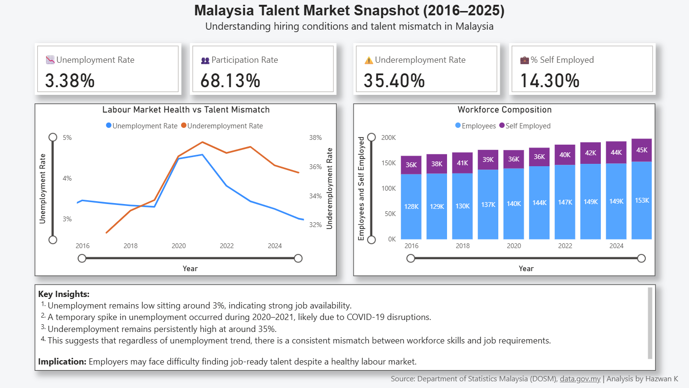

# 📊 Malaysia Talent Market Dashboard (Power BI)

This project analyzes Malaysia’s labour market trends using official open data, focusing on employment conditions, workforce structure, and skills mismatch.

---

## 🎯 Objective

To understand:
- Labour market health (unemployment trends)
- Talent mismatch (underemployment trends)
- Workforce composition (salaried vs self-employed)

---

## 📊 Key Insights

- Unemployment remains relatively low (~3–4%), indicating stable job availability  
- A temporary spike in unemployment occurred during 2020–2021 due to COVID-19 disruptions  
- Underemployment remains high (31%–38%), indicating persistent skills mismatch  
- The gap between low unemployment and high underemployment highlights inefficiencies in talent matching  

💡 **Implication:**  
Employers may face difficulty finding job-ready talent despite a healthy labour market

---

## 🛠 Tools Used

- Power BI  
- Power Query (data transformation & cleaning)  
- DAX (measure calculations)  

---

## 📂 Data Sources

- Department of Statistics Malaysia (DOSM)  
- data.gov.my  

---

## 🚀 Dashboard Features

- KPI cards for labour market indicators  
- Dual-axis trend analysis  
- Workforce composition visualization  
- Insight-driven summary  

---

## 👨‍💻 Author

Hazwan Bin Kamaruzzaman  
Senior Engineer | Aspiring Data Analyst
